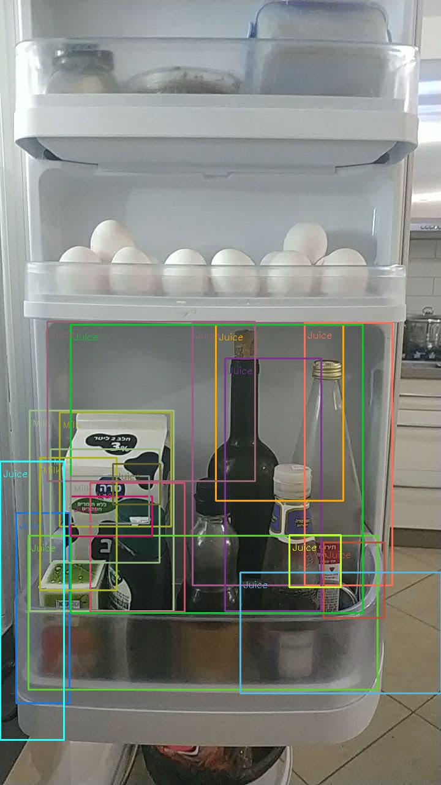
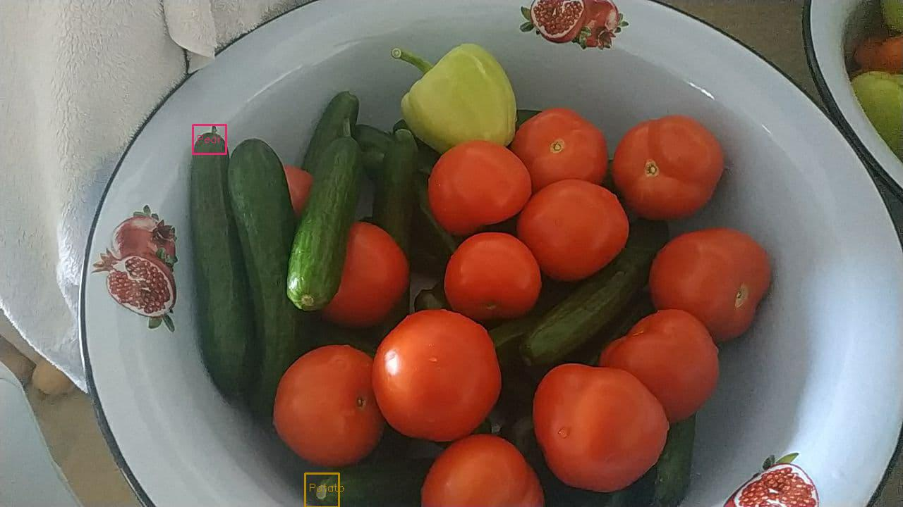
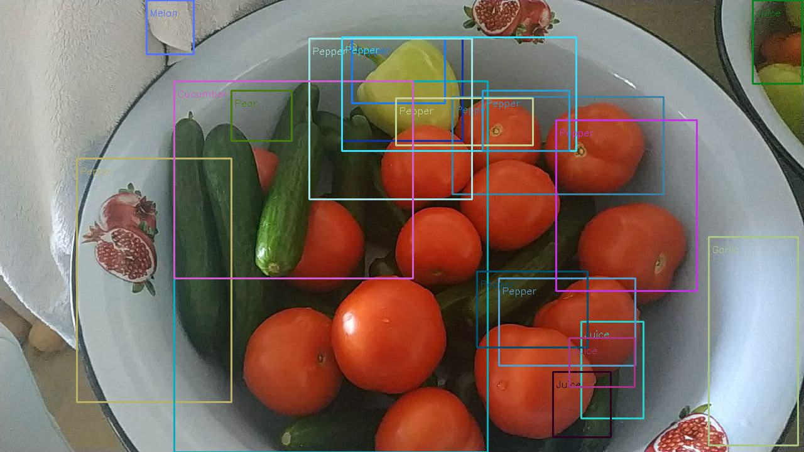

# Fridge Vision

This is the final assignment for the course Principles of Programming Languages at Ben Gurion University.
> authors: shoahm zarfati - 318501418, hod twito - 315230482

# 2. Goal 

We wanted to develop an application that could infer from an image of your fridge what groceries you need to buy.
This is a particularly challenging problem even in object detection because there is not that much data specific for this problem.
Most if not all the data we found was labeled images of groceries in the store or a supermarket.
The difference might not be noticeable, but groceries in your fridge at home often look very different,
if it's because of how they are ordered or in what containers they are placed. We believe
that this problem can be solved using modern machine learning methods and made accessible to everyone.
This will make the process of deciding what you need to put on your grocery list much more comfortable and might
also prevent some issues of forgetting when and what groceries to buy.

# 3 + 5. Literature Review

Here we review some of the work done in object detection and grocery detection in images.
We did not focus on applications used to generate shopping lists, as most of them are either built into fridges
or use simpler methods. In any case, we wanted to focus more on the machine learning side
(which is reflected in our very simple functionalities in terms of shopping list generations).


## Object Detection

The field of object detection is very popular in machine learning as a result of many advancements that were made in the last 5-10 years. 
Object detection is a task where the model is given an image containing several objects and is expected to identify where each object is located in the image (usually by drawing a box around the object) and identify the class of each object (in our case, the class is the type of grocery like milk apple, etc.). 

Object detection is a very similar task to image classification (where each image is given a single class).
With the introduction of [AlexNet](https://proceedings.neurips.cc/paper/2012/hash/c399862d3b9d6b76c8436e924a68c45b-Abstract.html),
proving the effectiveness of CNN networks in image classification, many others followed in different image-related tasks.
The simplest approach to object detection is introduced in [Ross B. Girshick et al.](https://arxiv.org/abs/1311.2524v5) as the R-CNN model. Here the input image is segmented into
many small images. Each of those is fed into an AlexNet classifier, and finally, the AlexNet embeddings are fed into an SVM model for
the final classification for each image segment. With this approach, we can turn any classifier into an object detector by simply adding
this image segmentation at the start. The algorithm used for segmenting the image is called Selective Search. We have used the same approach
only with a different classifier, and we have found two major downsides to this method. First is the runtime because we need to feed all the 
smaller images into the classifier. The classifier needs to do a lot of work that might seem avoidable. The second is the region selection. 
Selective search is relatively good, produces pretty good regions for the classifier, but it obviously cannot consider the data that we are training on,
which makes it very general yet not very good for specific use cases. 

In order to address the issues of runtime and region selection, later methods opted to use "end-to-end" deep neural networks that would be able to predict both the
bounding boxes for the objects and the classes associated with them. This is done by training a network on a dataset where each
image has the coordinates of bounding boxes it contains and the classes for each box. The network is then trained with two outputs, 
a regressor and a classifier. The regressor predicts the coordinates of the bounding boxes, while the classifier predicts the class for each bounding box. 
Finally, a combined loss function is used to guide the training process. This approach means that the network needs to only run once for each image, 
making the network both much faster and able to create more informed decisions on bouncing boxes since it can train on them. 
The architecture described here was introduced in [Fast R-CNN](https://arxiv.org/abs/1504.08083) 
and later improved upon by similar methods such as Faster RCNN YOLO and many more.


## Grocery Detection

Most of the work we found on grocery detection was for detecting groceries in stores and supermarkets.
Even the dataset we used is of supermarket groceries and not fidges. This makes sense because supermarket grocery detection is generally a 
little simpler because of the way the products are separated, and it has a better market as supermarkets can use such systems for keeping track of supply.
One interesting paper we found was [Eran Goldman et al.](https://arxiv.org/abs/1904.00853), where they use an "end-to-end" method similar to Fast RCNN on a very large dataset of annotated images 
of supermarkets with very precise annotation of bounding boxes, up to hundreds per image. This dataset was very impressive but also very 
specialized for supermarkets, in addition to being a little too big for our purposes. Another dataset we considered is [The Freiburg Groceries Dataset](https://arxiv.org/abs/1611.05799). 
The data set was of a manageable size. The paper suggested an approach similar to the original RCNN, and we even tried to train a classifier on it, 
which worked very well. However, the classes in this dataset are not very representative of what you would find in a fridge. We finally settled on a subset of 
[this](https://github.com/marcusklasson/GroceryStoreDataset) data set only titled as "Grocery Store Dataset". We selected 18 classes we thought best represent what you could find in a fridge and trained a classifier on those. The final dataset we created is available on google drive [here](https://drive.google.com/file/d/1yXoDMSPodJb1xBprxplTWy9XwgJm9Mcl/view?usp=sharing)

# 4. Instructions

Let us start with the project structure, and later we will discuss installation and different usage modes.

## Structure

-  environment config - we provide two files, `requirements.txt` and `conda_env.yml`. These files offer the ability to replicate the development environment used to develop this project.
- `FridgeVision.ipynb` - contains the notebook used to train the classification models and provides an explanation of our results and model selection.
-`frv.py` - is a CLI application meant to be a controller for the project, launch the web app, and make predictions and run the applications in CLI mode.
- `api.py` - is the webserver for the application. It can be launched using the `frv.py` CLI using the `serve` command.
- `webapp` - contains the front end of the web application written in vue.js. When running `serve` for the first time, the front end will be compiled to static files able to be served by flask and put into a new directory `static`. It is also possible to download the application with the compiled front end from the Github Releases.
- `core` - contains the core logic of the application. It is used both by the CLI and the webserver. Inside `core` there are two files:
 	- `detection.py` - here, we can find the code that performs the object detection and all its subtasks like image classification and region selection.
	- `users.py` - here, we can find the database controller for the user's data.
- `test_imgs` - contains a few images usfull for testing the application.
- `.frv` - this is a folder that generates when downloading the model and labels map or running the application, containing the application configuration.
- `doc` - contains some of the documentation for this project, files such as literature review, a presentation, and alike.

## Installation

Because the project relies on machine learning and the TensorFlow library, the project can theoretically be run on the GPU, meaning the models would be much quicker in providing results. This is not guaranteed to be supported through the provided environment files. 
Before moving on, we want to stress that the project works perfectly fine on the CPU apart from slower runtimes.
The GPU configuration is more complicated due to incompatibility between TensorFlow versions and anaconda distributions of those versions.
This project requires Tensorflow version 2.3.* and does not support version 2.1.*. Those requirements and anaconda not properly installing drivers for the 2.3 distribution make the configuration for GPU more difficult.


To install the GPU version, you must first create a conda environment with the following command :
```sh
conda create -n <env name> python=3.7 tensorflow-gpu=2.1 opencv pillow flask
```
next install typer on this environment: 
```sh
conda install -c conda-forge typer 
```
now that the environment is ready with TensorFlow 2.1, you need to update TensorFlow manually using pip: 
```sh
pip install tensorflow-gpu==2.3
```
now the environment should be ready to run the project and use the GPU.
Finally, if you wish to recompile the webapp you must have [node.js](https://nodejs.org/en/) and [vue.js](https://cli.vuejs.org/guide/installation.html) installed


# Implementation

Here we discuss our implementation of the classifier, the region selection we use, and how we combine it all for object detection, in addition to the application itself and its APIs.

## Object Detection

Our classifier is based on the pre-trained [Keras](https://keras.io/api/applications/) EffecientNetB3 network. We also tried training a B0 network, but B3 provided better results at minimal costs.
A more detailed overview of the model implementation is available in the Jupyter notebook, as well as detailed training results that are available 
[here](https://wandb.ai/zshoham/FridgeVision/table?workspace=user-zshoham). Later, for the detection step, as we discussed in the literature review,
we used Selective Search as implemented in [OpenCV](https://docs.opencv.org/4.5.1/d6/d6d/classcv_1_1ximgproc_1_1segmentation_1_1SelectiveSearchSegmentation.html)
in order to create classification regions. Thought we quickly found that selective search created around 20 thousand regions for some images, which is way too much to run on a single GPU, 
not to mention a CPU. In order to decrease the number of regions, we used an algorithm called Non-Maximum Suppression. 
This algorithm removes regions that overlap with each other too much, creating a more manageable number of regions. 
Additionally, we manually eliminated regions that were too small to capture anything meaningful.

Finally, in order to improve accuracy, we also tried to use another variation of Non-Maximum Suppression implemented in 
[tensorflow](https://www.tensorflow.org/api_docs/python/tf/image/non_max_suppression).This algorithm takes into account the prediction probability 
of the classifier when filtering out overlapping bounding boxes, 
which means that only the highest probability detections will stay. This increased performance because the prioritization could take into 
account what the model thinks of the image instead of randomly removing overlapping boxes. On the other hand, this requires running the model on all 
regions produced by Selective Search, making it the slowest method of detection we implemented.


## Application

Our application has two user-facing parts, a CLI and a web UI. The CLI is much more flexible, providing five commands for the user in order to use the application and configure it.
- classify - given an image, runs the classification model on it, and prints the results.
- detect - given an image, runs the whole detection pipeline on the image printing the detected groceries as well as showing the image with bounding boxes drawn on it.
- download-config - downloads a model and label mapping to be used by the application. By default, it downloads the model we trained and the mapping between the numeric classes and the English classes we used.
- run - runs the application with the provided username and image if the username hasn't been seen before printing all the detected groceries. If the username is saved in the database, printing the missing groceries compared to the original image.
- server launches the flask web server and opens a browser to the web app URL.

The web app is much simpler, providing only the functionality available in the run command of the CLI. The app contains a form for inserting the username and uploading an image.
Once the user sends the form, it is received by the flask app, and the detection pipeline is run on it. The server returns the appropriate message to the client describing what 
groceries he is missing or just what groceries appear in the image if it's the first time the username was seen. 
It is important to note that the database is shared between the CLI and the webserver.


# 5. Results

Here we show some of our final results and discuss what went right and went wrong, and how it could be improved. The means to generate all these examples are in the repository. These are different runs of the detect command on the test images. Let's start with a relatively good example: 



In this image, we can see a photo of the side of a fridge. The only item shown that exists in the classes that the model has learned is milk. We can see that we get a few regions detecting the milk correctly. Additionally, we can see the model classifies all the other bottles on the fridge as juice. Most of these detections are obviously wrong, but we can clearly see how bottles translate in shape to juice, and since the model never saw such objects, it shows it learned how to generalize very well.
This image was produced by the command 
```
python .\frv.py .\test_imgs\milk.jpg -q high
```



In the image above, we can see the model struggled to detect anything meaningful in the image, only producing two small bounding boxes with the wrong labels. This image was generated using the command 
```
python .\frv.py .\test_imgs\cucumber.jpg
```
meaning it used selective search with normal non-maximum suppression, and most of the meaningful bounding boxes got rejected. Next, let's see how the same image looks when we use high-quality detection, which uses TensorFlow's non-maximum suppression. The image was generated using the following command:
```
python .\frv.py .\test_imgs\cucumber.jpg -q high
```



We can imminently see the improvement. There are a lot more bounding boxes, and most of them are correct. Furthermore, the red peppers can be hard to identify even for humans as they seem more like tomatoes, but the model can recognize them as peppers very consistently.


# 6. Conclusion

In conclusion, we feel that we learned a lot in this project, both about object detection and about python and how to create real-world projects in it.
Our application is obviously not perfect and has a long way to go until someone would actually use it, but we think that as a proof of concept, it is very impressive. We believe that if some more work is put into collecting data from actual fridges in addition to creating annotations for it, it would be almost trivial to create working real-time models using some of the more recent approaches in the field like YOLO.