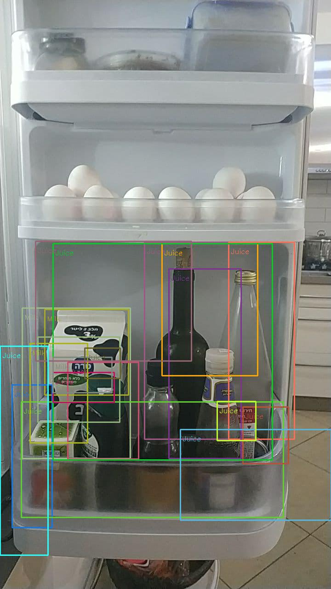
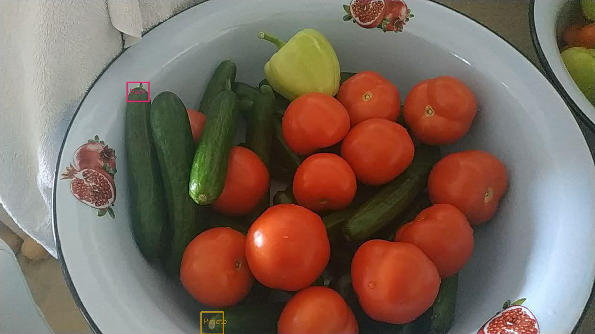
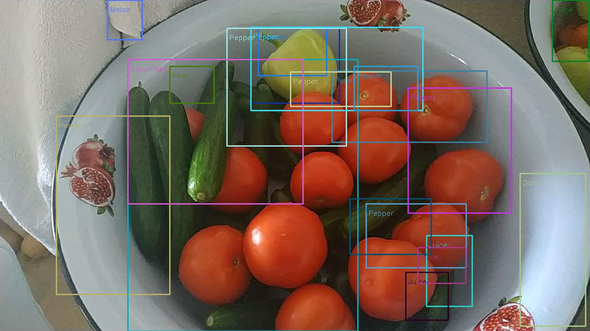

# Results

Here we show some of our final results and discuss what went right and went wrong, and how it could be improved. The means to generate all these examples are in the repository. These are different runs of the detect command on the test images. Let's start with a relatively good example: 



In this image, we can see a photo of the side of a fridge. The only item shown that exists in the classes that the model has learned is milk. We can see that we get a few regions detecting the milk correctly. Additionally, we can see the model classifies all the other bottles on the fridge as juice. Most of these detections are obviously wrong, but we can clearly see how bottles translate in shape to juice, and since the model never saw such objects, it shows it learned how to generalize very well.
This image was produced by the command 
```
python .\frv.py .\test_imgs\milk.jpg -q high
```



In the image above, we can see the model struggled to detect anything meaningful in the image, only producing two small bounding boxes with the wrong labels. This image was generated using the command 
```
python .\frv.py .\test_imgs\cucumber.jpg
```
meaning it used selective search with normal non-maximum suppression, and most of the meaningful bounding boxes got rejected. Next, let's see how the same image looks when we use high-quality detection, which uses TensorFlow's non-maximum suppression. The image was generated using the following command:
```
python .\frv.py .\test_imgs\cucumber.jpg -q high
```



We can imminently see the improvement. There are a lot more bounding boxes, and most of them are correct. Furthermore, the red peppers can be hard to identify even for humans as they seem more like tomatoes, but the model can recognize them as peppers very consistently.